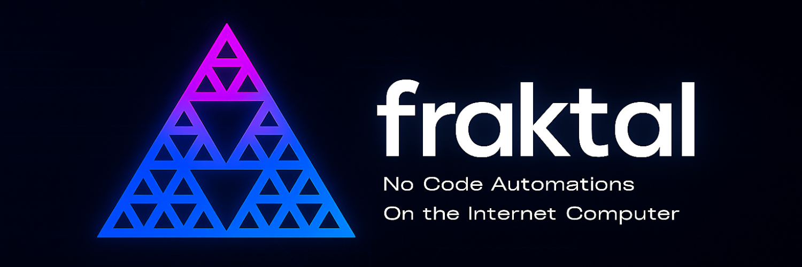
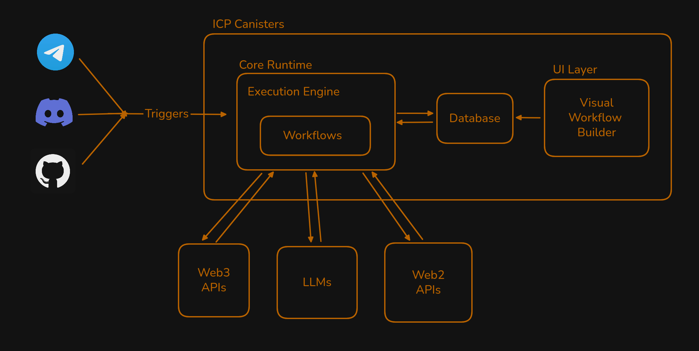

# Fraktal

Bring No-Code Automation On-Chain. Design and deploy powerful automated workflows without writing backend code - no servers, no limits. Connect Web2, Web3, and AI services using modular triggers and actions that run natively on the Internet Computer.

🧠 Built for #WCHL2025 • 🔗 [Visit App](https://x.com/fraktal_app) • 🌐 Powered by Internet Computer (ICP)

<br>

## Overview

**Fraktal** is a no-code automation platform for building and executing decentralized workflows on the [**Internet Computer (ICP)**](https://internetcomputer.org/). It empowers developers and non-developers alike to create powerful automations using modular **triggers** and **actions** — all without writing backend code.

Fraktal abstracts complex integrations across **Web2**, **Web3**, and **AI/LLM** services into composable building blocks. Whether you're reacting to a GitHub issue, automating Telegram bots, posting to Discord, or chaining prompts with AI models - Fraktal makes it possible without servers or infrastructure management.

Workflows run natively on-chain, leveraging [ICP’s decentralized, serverless architecture](https://internetcomputer.org/docs/current/developer-docs/overview/what-is-ic/) for **trustless**, **persistent**, and **low-latency** execution. Whether you're a developer, builder, or curious hacker, Fraktal gives you the tools to automate the future one block at a time.

<br>

## Core Principles

- **Trustless & Serverless Execution**: Fraktal workflows run entirely on the Internet Computer, leveraging decentralized canister smart contracts for persistent, verifiable, and censorship-resistant automation — with no centralized servers or backend infrastructure required.

- **Modular Design**: Built around composable triggers and actions, Fraktal enables users to create powerful, reusable automation logic without writing custom backend code.

- **Interoperability**: Fraktal bridges Web2, Web3, and AI ecosystems through integrations with platforms like GitHub, Telegram, Discord, LLMs, and blockchain wallets.

- **No-Code Accessibility**: Fraktal is designed for developers and non-developers alike — empowering anyone to build, visualize, and deploy complex automations with ease.

<br>

## Features

#### 1. Visual Workflow Builder
- Build and edit automations using an intuitive drag-and-drop interface.
- Define triggers, actions, and data flows without writing backend code.
- Chain blocks and monitor state visually.

#### 2. Modular Trigger-Action Blocks
- Every workflow is composed of reusable **blocks**:
  - **Triggers**: Listen for events (e.g., Telegram messages, GitHub webhooks).
  - **Actions**: Perform tasks (e.g., send Discord message, prompt an LLM model).
- Add new integrations easily by creating or installing new blocks.

#### 3. On-Chain Execution, Secure by Design
- Powered by the [Internet Computer (ICP)](https://internetcomputer.org/):
  - Workflows run entirely on-chain in tamper-proof smart contract canisters.
  - No centralized servers or third-party hosting.
  - Fully decentralized, scalable, and censorship-resistant by design.
  - Persistent storage, transparent logic, and no vendor lock-in.

#### 4. Cross-Platform Integrations
- Connect services across Web2, Web3, and AI ecosystems:
  - **Telegram**: Bot commands, message replies.
  - **Discord**: Server message triggers, bot mentions, automated replies.
  - **GitHub**: Respond to issues, pull requests, and pushes.
  - **Email**: Send templated notifications directly from workflows.
  - **Web3 Wallets**: Query balances, track activity.
  - **Token Prices**: Fetch live crypto prices and react to market changes.
  - **AI/LLMs**: Generate text, summaries, or decisions using GPT-like models.

#### 5. Real-Time Event Handling
- Fraktal listens for live events and immediately executes workflows.
- Webhooks and message listeners allow near-instant response across platforms.

#### 6. Data Export & Interoperability
- Each block can export its output for downstream use.
- Chain AI outputs to message actions, or wallet data to price alerts.
- Create modular, composable, and reusable automation logic.

<br>

## Usage Guide


#### 1. Create a New Flow

- Go to the **Fraktal** dashboard.
- Click **"Create Flow"**.


#### 2. Add a Trigger

Every automation starts with a **Trigger Block** — an event that kicks off your flow.
Examples:
- New message on Telegram
- Mention in Discord
- GitHub push/commit

Drag a trigger from the sidebar into the canvas. Configure the block by entering the required parameters. You can export data from the trigger for usage in the next blocks.


#### 3. Add Actions

Next, attach one or more **Action Blocks** that perform tasks when the trigger fires.

You can:
- Send messages on Telegram/Discord
- Query wallet data
- Fetch token prices
- Run an LLM (AI) prompt
- Send email alerts
- Or combine them all!

Drag a action from the sidebar into the canvas. Configure the block by entering the required parameters. Some field that have `$` can use exported data from previous blocks.

#### 4. Save Your Flow

- Use the **Save Workflow** 
- Add a title and click save
- Your workflow is now live!


<br>

## Supported Integrations

Fraktal currently supports blocks for:

- **Telegram** – Bots, message-based triggers, and actions.
- **Discord** – Server events, message actions, and user interactions.
- **GitHub** – Issues, pull requests, push events, and repo automation.
- **Web3** – Wallet tracking, token prices, balances, and ENS resolution.
- **AI/LLMs** – Text generation, summarization, and prompt chaining.
- **Email** – Template-based email sending with services like SendGrid.

More integrations and advanced conditionals (filters, branches, loops) are coming soon.

For a full breakdown of available blocks, their parameters, and usage examples, see [`Blocks Information`](./docs/README.md).


<br>

## Architechture 



<br>


## Instructions for Running Locally

- Clone the Repo

- Add .env from `.env.example`

- `npm install`
- `cd src/frontend` & create .env in `src/frontend` from `.env.example`

- `npm install`
- `cd ../..`
- `dfx start --clean`
- `dfx canister create --all`
- `source scripts/add-env.sh`
- `dfx deploy`
- Start execution engine by: `ngrok http 4943 --host-header="bkyz2-fmaaa-aaaaa-qaaaq-cai.raw.localhost" --url="<execution-url>"`
- Start Discord bot in `services/discord-bot` using `ngrok http 5000 --host-header="bkyz2-fmaaa-aaaaa-qaaaq-cai.raw.localhost" --url="<discord-bot-url>"`


<br>


## Tech Stack

| Layer             | Tech/Tooling                                |
|-------------------|----------------------------------------------|
| **Frontend**      | React.js, Tailwind CSS, ShadCN UI |
| **Backend**       | Node.js (Express)                            |
| **Execution Engine** | Internet Computer (Azle)            |
| **Integrations**  | Telegram, Discord, GitHub, Web3, LLMs, Email |
| **Infra**         | ICP (Execution), Ngrok (Dev Tunnels) |


<br>


## Folder Structure

```
fraktal/
├── docs/                  # Documentation and architecture assets
├── scripts/               # Utility scripts (e.g., env setup)
├── services/              # Microservices like the Discord bot
│   └── discord-bot/       # Discord bot code and migrations
├── src/                   # Core source code
│   ├── backend/           # Backend logic and routes
│   ├── database/          # Database setup and ORM entities
│   ├── execution-engine/  # Automation engine logic and block execution
│   ├── frontend/          # Frontend UI (Vite + Tailwind)
│   └── scripts/           # Interface definition files (e.g., DID for canisters)
```
